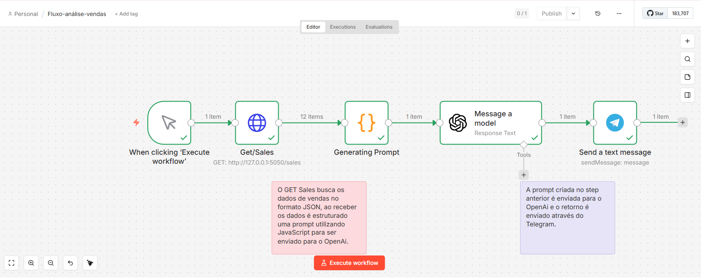
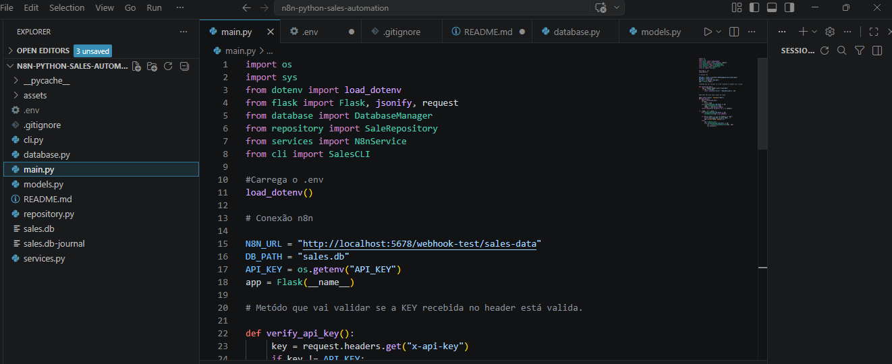
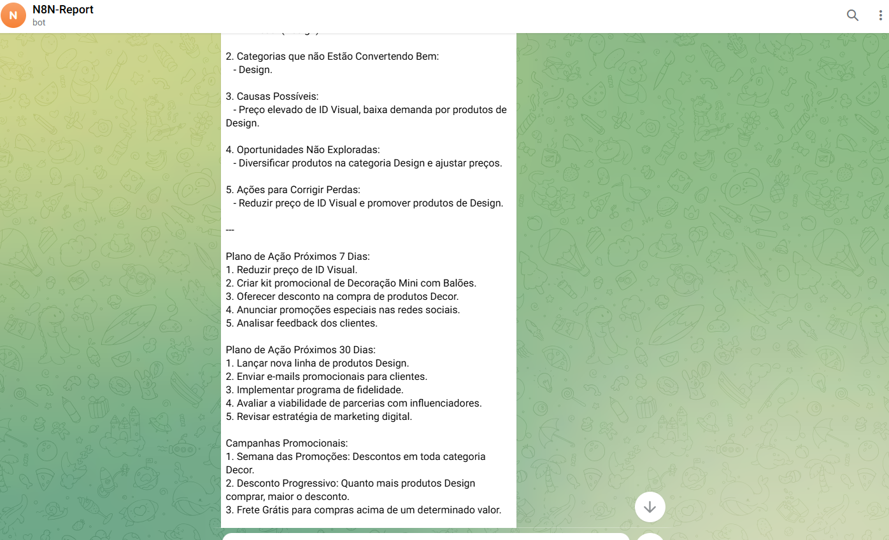

# N8N PYTHON SALES AUTOMATION

Automação inteligente de análise de vendas com Python, N8N, OpenAI e Telegram.
----

# Visão geral do projeto

O n8n Python Sales Automation é uma solução em desenvolvimento contínuo que automatiza a análise de dados de vendas utilizando Python, n8n e inteligência artificial. A aplicação já é capaz de coletar dados via API, processá-los e gerar insights estratégicos automaticamente, enviando os resultados para o Telegram.

O projeto segue em evolução, com foco em melhorias de arquitetura, segurança e experiência do usuário, visando se tornar uma solução cada vez mais robusta e escalável.

----

# Fluxo no n8n
<p align="center">
  
</p>

# Estruturação dos dados
<p align="center">
  
</p>

# Resultado da análise via Telegram
<p align="center">
  
</p>

##  Fluxo da automação

```
CLI Python → Salva no Banco (SQLite)
                    ↓
N8N → GET /sales → API Flask retorna JSON
                    ↓
            Generating Prompt (JavaScript)
                    ↓
            OpenAI analisa os dados
                    ↓
            Telegram recebe o relatório
```

---

# Objetivos

Pequenos negócios frequentemente possuem dados de vendas, mas não conseguem extrair valor estratégico deles.

Este projeto tem como objetivo a resolução desse problema ao:

* Transformar dados brutos em insights acionáveis
* Automatizar análises que seriam feitas manualmente
* Reduzir o tempo de tomada de decisão
* Apoiar o aumento de faturamento com base em dados

----

# Funcionalidades
  
* 📈 Análise automatizada de vendas
* 🧠 Geração de insights com IA
* 📦 Agrupamento por categoria
* 💰 Cálculo de receita total
* 🔍 Identificação de padrões e tendências
* 📩 Envio automático de relatórios para Telegram
* 🔐 Proteção de endpoint com API Key

---------

# Tecnologias utilizadas

| Tecnologia | Finalidade |
|---|---|
| Python 3 | Backend e CLI |
| Flask | API REST |
| SQLite | Banco de dados local |
| N8N | Orquestração da automação |
| OpenAI API | Análise inteligente dos dados |
| Telegram Bot | Envio do relatório |
| python-dotenv | Gerenciamento de variáveis de ambiente |

----

##  Arquitetura do projeto

O projeto foi refatorado seguindo os princípios de **Orientação a Objetos** e boas práticas de engenharia de software:

```
📁 n8n-python-sales-automation/
├── 📄 main.py         → Ponto de entrada: API Flask + CLI
├── 📄 database.py     → DatabaseManager: gerencia conexão com SQLite
├── 📄 models.py       → Sale: modelo de dados com dataclass
├── 📄 repository.py   → SaleRepository: queries SQL isoladas
├── 📄 services.py     → N8nService: integração com serviços externos
├── 📄 cli.py          → SalesCLI: interface de terminal
├── 📄 .env            → Variáveis de ambiente (não versionado)
└── 📄 .gitignore      → Arquivos ignorados pelo Git
```

# Segurança

A API implementa autenticação via API Key para proteger o endpoint de vendas.

Boas práticas aplicadas:

* Proteção de rota com verificação de header
* Separação de responsabilidades
* Planejamento de uso de variáveis de ambiente (.env)

Evoluções planejadas:

* Implementação de .env
* Autenticação via JWT
* Logs de acesso

-----


# Evoluções planejadas

* Criação de dashboard front-end
* Visualização gráfica de dados
* Deploy em nuvem
* Transformação em produto SaaS

----
 
# Diferencial do projeto

Este projeto se destaca por integrar:

* Automação de workflows
* Análise de dados
* Inteligência artificial

Gerando valor real para negócios de forma automatizada.

----

## 🤝 Vamos nos conectar

- LinkedIn: https://www.linkedin.com/in/artemis-costa/
- Email: artemiscomoura@hotmail.com
